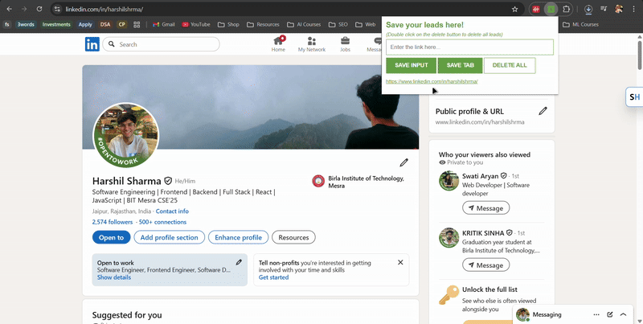

# JavaScript Practice Projects

A collection of **JavaScript mini-apps** built while learning DOM manipulation, browser APIs, Chrome Extension development, Firebase, and mobile-friendly UI design.

## Key Learnings
- DOM selection & manipulation  
- Handling user events  
- Dynamic UI updates  
- LocalStorage usage  
- Randomness & game logic  
- Chrome Extension development  
- Firebase Realtime Database (read/write, live sync)  
- Mobile responsive layouts & app-like interfaces  
- Clean code structure for small JS apps  

## How does each project look?

### [4. Lead Tracker Mobile App (with Firebase) [Progressive Web App]](./4_lead_tracker_mobile_app)
A mobile-friendly PWA version of the Lead Tracker app with **Firebase Realtime Database** for persistent cloud storage.

🔗 **Live Demo:** https://hs-leads-tracker-app.vercel.app/

**Concepts:**  
- Firebase Modular SDK (initializeApp, getDatabase, ref, push, onValue)  
- Real-time DB sync  
- PWA manifest, icons, home-screen compatibility  
- Mobile-first UI/UX  

### [3. Lead Tracker Chrome Extension](./3_lead_tracker_extension)
A Chrome extension that saves URLs, tabs, and user inputs efficiently.

🔗 **Live Demo:** https://javascript-practice-jggd.vercel.app/

**Concepts:**  
- Manifest v3  
- Chrome Tabs API  
- LocalStorage persistence  
- Interactive DOM updates  

### [2. Blackjack Game](./2_blackjack_game)
A simple Blackjack game built using pure JavaScript logic.

🔗 **Live Demo:** https://javascript-practice-mvnx.vercel.app/

**Concepts:**  
- Randomness & card logic  
- Game rules & state  
- Dynamic rendering  

### [1. Passenger Counter](./1_passenger-counter)
A basic passenger counter app that tracks entries dynamically.

🔗 **Live Demo:** https://javascript-practice-one-pi.vercel.app/

**Concepts:**  
- DOM manipulation  
- Event handling  
- UI state updates  

